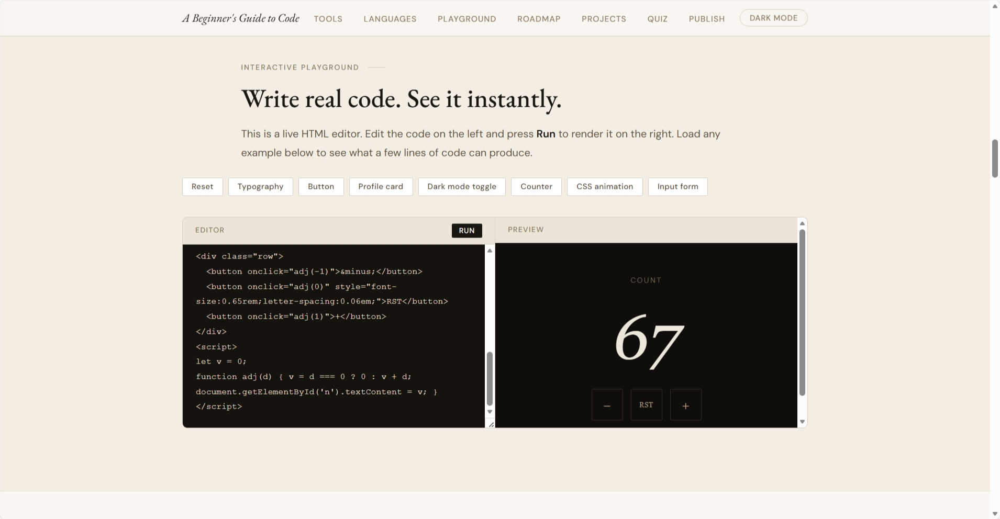

# KatCodes for Everyone


Learn the fundamentals of coding with a simple, beginner-friendly interactive guide.

🌐 **Live Site:** [https://chineme-eng.github.io/KatCodes-for-Everyone/](https://chineme-eng.github.io/KatCodes-for-Everyone/)

---

## About the Project

**KatCodes for Everyone** is a beginner coding guide designed for people who want to start programming but don’t know where to begin.

Instead of overwhelming users with theory, the site focuses on **practical steps, simple explanations, and interactive learning**.

Users can explore tools developers use, try writing code directly in the browser, and follow a structured roadmap toward building their first real projects.

The goal is to make coding feel **accessible, clear, and achievable for anyone.**

---

## Features

* Beginner-friendly explanations of coding concepts
* Recommended tools for new developers
* Interactive coding playground
* Step-by-step learning roadmap
* Beginner project ideas
* Short quiz to test understanding
* Guide for publishing your own website online

---

## Built With

* **HTML**
* **CSS**
* **JavaScript**
* **GitHub Pages** for deployment

---

## Project Structure

```
KatCodes-for-Everyone
│
├── index.html
├── styles.css
├── script.js
└── assets/
    └── images/
```

---

## Getting Started

If you want to run the project locally:

```bash
git clone https://github.com/chineme-eng/KatCodes-for-Everyone.git
```

Open the folder and launch **index.html** in your browser.

---

## 📸 Preview



---

## Who This Is For

This guide is designed for:

* Complete beginners learning their **first programming language**
* Students exploring **web development**
* Anyone who wants a **simple path into coding**

---

## Future Improvements

Possible future updates include:

* More beginner projects
* Expanded coding exercises
* Additional language guides
* More interactive elements

---

## License

This project is open source and available for learning and educational use.

---


